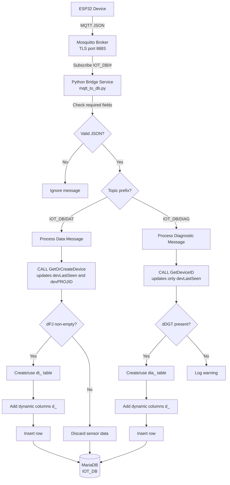
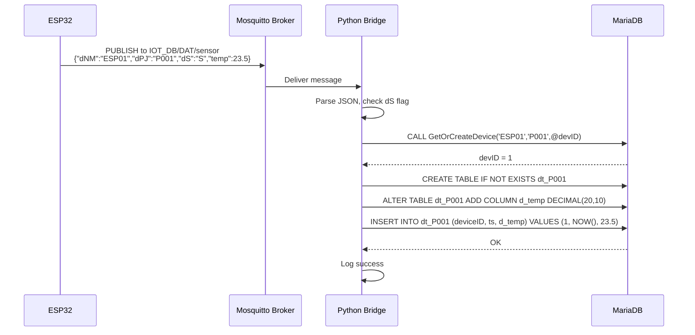
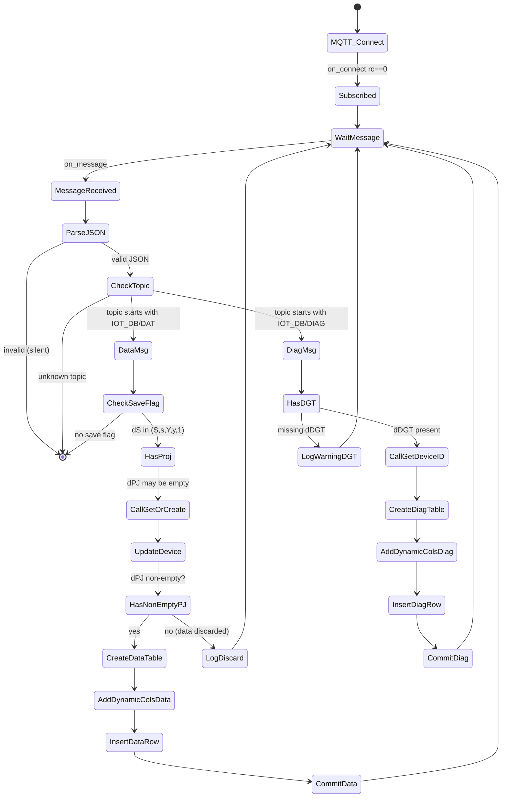

# MQTT to MariaDB Bridge – Configuration & Documentation

## Overview

This bridge subscribes to MQTT topics under `IOT_DB/#` and stores JSON messages from ESP32 devices into a MariaDB database.
Two message types are supported:

- **Data messages** (`IOT_DB/DAT/...`) – require `dNM`, `dPJ`, `dS` fields. Saved into project‑specific tables `dt_<projectID>`.
- **Diagnostic messages** (`IOT_DB/DIAG/...`) – require `dNM`, `dDGT` fields. Saved into diagnostic tables `dia_<diagnostic_type>`.

The bridge automatically creates tables and columns on the fly based on the JSON structure.

## System Architecture



## JSON Message Formats – Flow



## Configuration

All settings are read from **environment variables** (keeps credentials out of the script).

### Environment variables

| Variable | Description | Example |
|----------|-------------|---------|
| `MQTT_BROKER` | MQTT broker hostname or IP | `raspi00` |
| `MQTT_PORT` | MQTT port (TLS usually 8883) | `8883` |
| `MQTT_USER` | MQTT username | `your_mqtt_user` |
| `MQTT_PASS` | MQTT password | `your_mqtt_password` |
| `MQTT_TLS_ENABLED` | `true` or `false` | `true` |
| `MQTT_TLS_CA_CERTS` | Path to CA certificate file | `/etc/mosquitto/certs/ca.crt` |
| `DB_HOST` | MariaDB host | `localhost` |
| `DB_USER` | Database user | `your_db_user` |
| `DB_PASS` | Database password | `your_db_password` |
| `DB_NAME` | Database name | `IOT_DB` |
| `LOG_LEVEL` | Logging level (`DEBUG`, `INFO`, `WARNING`, `ERROR`) | `INFO` |

### Where to change username/password

1. **MQTT authentication** – set `MQTT_USER` and `MQTT_PASS` in the environment file.
2. **Database authentication** – set `DB_USER` and `DB_PASS` in the same file.

Example environment file (`/etc/mqtt2db/env`):

```
MQTT_BROKER=raspi00
MQTT_PORT=8883
MQTT_USER=someone
MQTT_PASS=secret123
DB_USER=someDbUser
DB_PASS=myDbPass
LOG_LEVEL=INFO
```

## Logging

The bridge logs to two places (configurable in the script):

- **Systemd journal** – view with `journalctl -u mqtt2db.service -f`
- **File** – default location `/var/log/mqtt2db/mqtt2db.log` (rotation: 10 MB per file, 5 backups)

### Viewing logs

| Action | Command |
|--------|---------|
| Follow live logs (systemd) | `sudo journalctl -u mqtt2db.service -f` |
| Show last 100 lines | `sudo journalctl -u mqtt2db.service -n 100` |
| Follow file log | `tail -f /var/log/mqtt2db/mqtt2db.log` |
| Search for errors | `grep ERROR /var/log/mqtt2db/mqtt2db.log` |

To change the log level, set `LOG_LEVEL=DEBUG` (or `WARNING`) in the environment file and restart the service.

## How the Bridge Works – Internal Flow



## Requirements for Dynamic Table Creation

The bridge can create tables and columns of **any name** as long as:

- The identifier (project ID or diagnostic type) consists of alphanumeric characters and underscores.
  Other characters are stripped; if the result is empty, an error is logged.
- The JSON field names (except reserved ones) are sanitised (`[^A-Za-z0-9_]` replaced with `_`).
- Column names are limited to 64 characters (MySQL limit). The bridge does not enforce this; very long JSON keys may cause errors.

### Data types assigned automatically

| JSON value type | SQL column type |
|----------------|----------------|
| boolean        | `TINYINT(1)`    |
| integer        | `BIGINT`        |
| float          | `DECIMAL(20,10)`|
| string         | `VARCHAR(255)`  |
| other          | `VARCHAR(255)`  |

These types are **fixed** when the column is first created. Subsequent messages with different types may cause truncation or errors (logged in `E_LOG`), but the column type will not change.

### Creating a new type of table

- **New project table** (`dt_XXXX`): send a data message with `dPJ` = `"XXXX"` (any alphanumeric string) and `dS` = `"S"`. The bridge creates the table and stores the data.
- **New diagnostic table** (`dia_YYYY`): send a diagnostic message with `dDGT` = `"YYYY"`. The bridge creates the table and stores the data.

## Installing as a Systemd Service

1. Create an environment file (see above) at `/etc/mqtt2db/env`.
2. Create the service file `/etc/systemd/system/mqtt2db.service`:

```ini
[Unit]
Description=MQTT to MariaDB Data Saver
After=network.target mariadb.service mosquitto.service

[Service]
Type=simple
User=pi
EnvironmentFile=/etc/mqtt2db/env
WorkingDirectory=/home/pi/MyStuff/IOT_DB
ExecStart=/home/pi/MyStuff/IOT_DB/venv/bin/python /home/pi/MyStuff/IOT_DB/mqtt_to_db.py
Restart=always
RestartSec=5

[Install]
WantedBy=multi-user.target
```

3. Reload systemd and start:

```bash
sudo systemctl daemon-reload
sudo systemctl enable mqtt2db.service
sudo systemctl start mqtt2db.service
```

## Troubleshooting

| Problem | Check |
|---------|-------|
| Bridge won’t start | `sudo journalctl -u mqtt2db.service -n 50` |
| MQTT connection fails | Verify `MQTT_BROKER`, `MQTT_PORT`, TLS cert path, username/password. |
| Data not saved | Ensure `dS` is present and valid, `dPJ` non‑empty. |
| Diagnostic not saved | Ensure `dDGT` is present. |
| Column creation fails | Check MariaDB permissions: user needs `ALTER` and `CREATE`. |
| Data truncation errors | See `E_LOG` table. Increase column size manually if needed. |

---

*Documentation version 3.1 – includes mermaid diagrams for flow and sequence.*